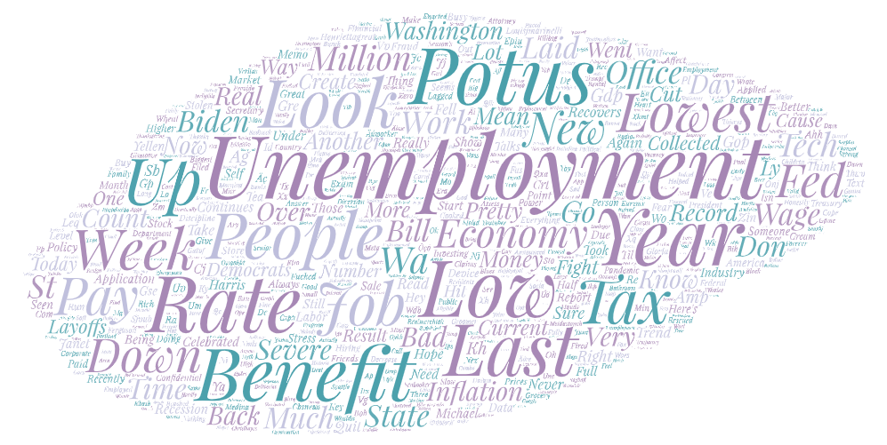
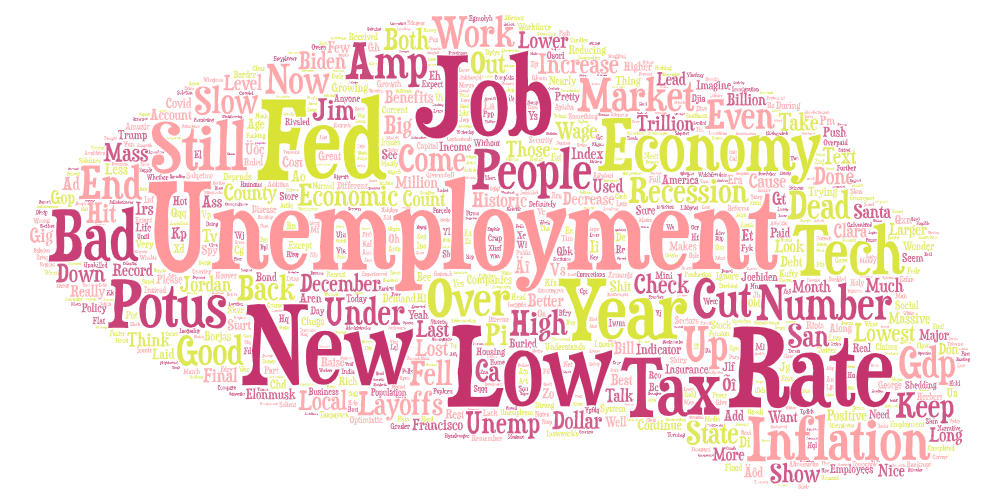
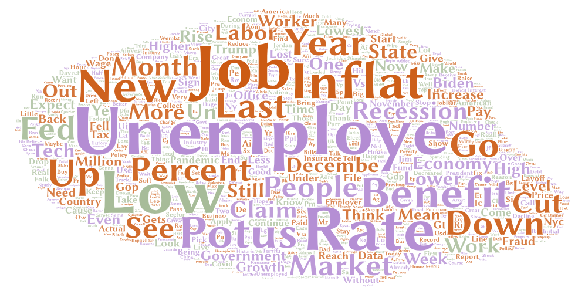

# Lab 2 Write Up

## Narrative
For this lab asssignemnt I used three locations where to my knowledge the most tech works live in. These include Seattle, San Francisco, and New York City. The radius within each city was set to 5.5 miles. The word I used to search twitter was "unemployment." I wanted to make these comparisons because in recent months and even weeks there have been mass layoffs in technology jobs. I wanted to know how people were feeling about this situation and if it is similar throughout these tech cities. From the generated clouds I noticed that there were many words that were similar, including potus, employment, low, rate, and tax. These paterns could be due to the govement being blamed for allowing so many people to be layed off all together and how tax rates are increasing. To prove this more research needs to be made with more words and also the number of employed people in each city. Some statistical analysis could also be made along with surveys. I found it interesting that there was little mention of the tech companies that have cause these lay offs, such as microsoft, apple, and meta. These also leaves me wondering if the people are discussin about these layoffs at all. 

## Seattle

## San Francisco 

## New York City

[Seattle Data](assets/twsearch-result_1.csv)

[San Francisco Data](assets/twsearch-result_3.csv)

[New York City Data](assets/twsearch-result_1.csv)
